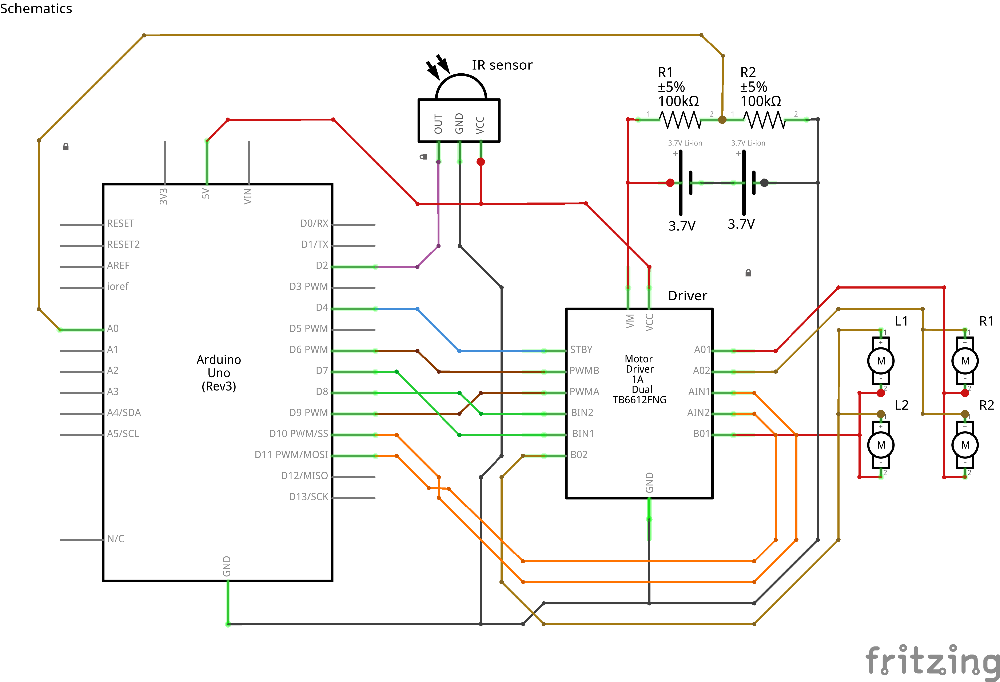

# 🤖 Rover Project: A robotic 4-wheel mobile platform with robotic arm on top of it.

    >Current Phase: Alpha (Manual Control & Basic Sensing)

## 🚀 Phase 1: Alpha (Current)
>The focuses on building foundation, basic input/output based robot.

>obstacle avoidance feature showcase:

https://github.com/user-attachments/assets/b6ce4320-d598-4152-bf0c-98a25c36b5d3

### Features

    >4-Wheeled arduino based robot.
    >smooth acceleration and deceleration feature.
    >IR Remote Control: Manual navigation using a standard IR remote.
    >can switch manual control and auto control(obstacle avoidance).
    >alarm when Low battery using active buzzer.
    >Obstacle Avoidance:Ultrasonic sensor integration.
    >Auto shutdown to protect battery: Arduino constantly checks battery voltage and if it falls below 6.6V(3.3V each cell) it cut off power supply to motor thus protecting battery from danger dead zone.
    >more coming...

### Hardware List

    >Chassis: dual deck made of foamboard(for astehtics) and 1cm thick Wooden sticks (for strength)
    >Controller: Arduino UNO R3
    >Input: IR Receiver(HX1838) + Remote
    >Sensors: HC-SR04 Ultrasonic
    >Motors:4x TT motor , 1:48 200rpm dual shaft
            1x SG90 servo motor
    >Power source: 2x Lithium ion 18650 3.7V 2600mAh Cells. connected in 2S formation to get total 7.4V.
                    Buck convertor to step down V to 5V.
    >Motor Driver: TB6612FNG 
    >5v Active buzzer
    >2x 100k Ohms Resistors

[Click here to view the Wiring diagram](./hardware/Wiring_diagram.png)

## 🗺️ The Master Plan

### 🔵 Alpha Phase (Building the Foundation)

    >Motor driver logic and chassis assembly.
    >IR Remote implementation for manual driving.
    >Next up: Add Ultrasonic sensors for obstacle avoidance.

### 🟡 Beta Phase (Adding Manipulation)

    >Mount a Multi-DOF Robotic Arm to the chassis.
    >Implement "Inverse Kinematics" code to control the arm's grip.

### 🟢 Stable Phase (Intelligence)

    >Integrate VLM (Vision Language Model) for high-level reasoning.
    >autonomous navigation.
    >Camera mount for real-time visual processing.
    >Voice/Text command capability for complex tasks.
